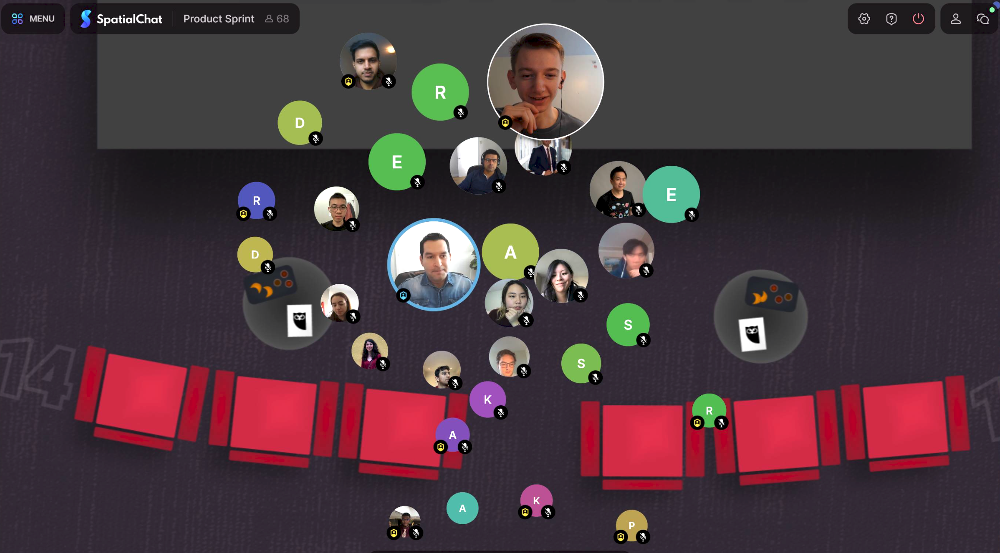
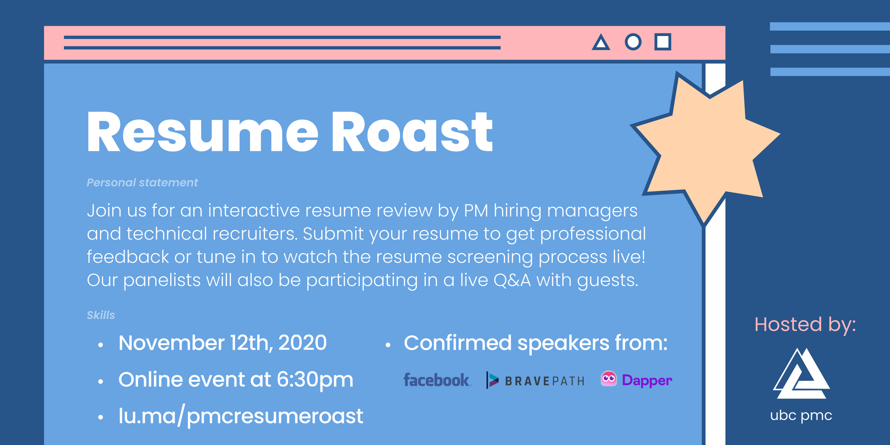
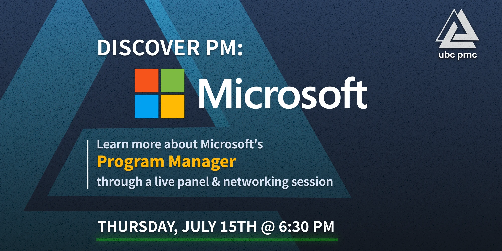
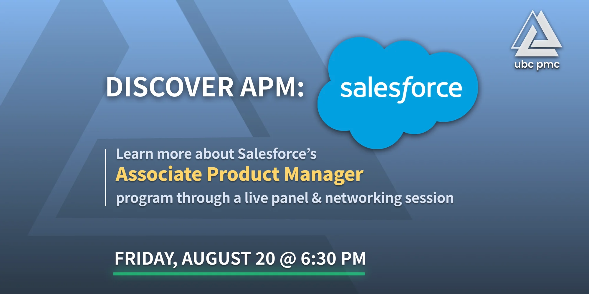
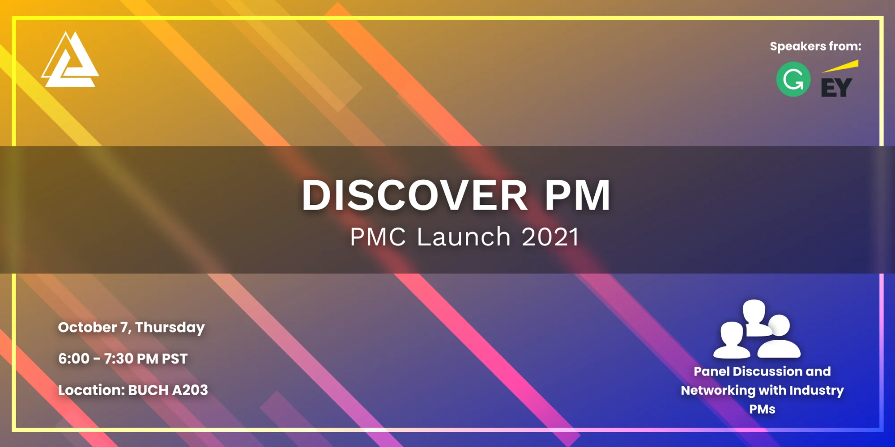
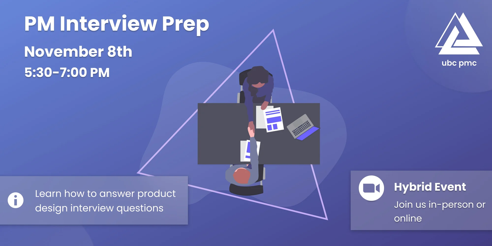

> Welcome to the University of British Columbia Product Management Club! We are thrilled to have you join our community and we hope that you find your experience here to be rewarding and inspiring. We are committed to providing our members with the resources and support they need to succeed, and our club's history is a testament to that mission. Keep scrolling to learn about our journey from inception to the present day.
> 

## Summary

UBC PMC is a community of aspiring product managers. From UBC and beyond, we have helped students build skills that have launched them into internships and careers in the growing field of product management.

Since the club was founded in June 2020, we have created:

**18 Speaker Events**: Featuring many speakers who are Senior PM, Group PM, VP Product, etc. at major U.S. and Canadian software companies.

**2-Week Product Sprint**: 50 product managers and 4 companies mentoring and judging each of the 24 teams competing for a $4,100 cash prize pool.

**Workshops led by PMs**: 10 workshops in product management skills, including feature prioritization and interviewing.

**Mentorship & Fellowship**: 2 distinguished programs for aspiring product managers to get their foot in the door and work with dozens of mentors from top tech companies.

**Product Hackathon**: 100 students from across Canada & U.S. in a variety of disciplines, solving problems by using newly-taught PM skills.

**Community Wins**: Over 400 students have joined our community. Many have since acquired product jobs and internships.

# 2020-21

## 🆕 Founding

---

UBC PMC was founded by Rachit Malik and Rithvik Alluri in May 2020.

Here’s a post made by Rachit on r/ubc to gauge interest for a product management club at UBC: 

> My friend and I were thinking of starting a Product Management club/community where we all could get together, learn more about the Product role through industry talks, networking events, mock interviews & get relevant experience through projects. In general our vision is to make this a community for students trying to break into the PM role and help new PMs!
> 

[Gauging interest for a Product Management Club at UBC!](https://www.reddit.com/r/UBC/comments/gk59ly/gauging_interest_for_a_product_management_club_at/)

## 🗣️ Speaker Series

---

Most of our past speaker events are available on [UBC PMC’s YouTube Channel](https://www.youtube.com/channel/UCkcrUv-e7GndWtFdihI9FGQ/videos).

### Discover PM

---

[https://www.youtube.com/watch?v=3AYmwUx5cME](https://www.youtube.com/watch?v=3AYmwUx5cME)

> Introducing UBC Product Management Club's first ever event: Discover Product Management!
> 
> 
> Join us virtually as we meet a panel of passionate Product Managers (PM) from diverse backgrounds who will be sharing their unique stories into how they discovered the world of Product Management.
> 
> Get a glimpse into what a typical day of a PM looks like and how ANYONE can break into the field of product management, even if you have no idea what that is right now - this event is designed to help you discover exactly that. Stay tuned to meet our amazing panel of speakers!
> 
> This is a FREE event, open to all students regardless of your year, faculty, or school. There will also be a Q&A segment using [sli.do](http://sli.do/)!
> 
- 📙 Further Reading
    - [https://lu.ma/pmcinterninsights](https://lu.ma/pmcinterninsights)

---

### Intern Insights

---

[https://www.youtube.com/watch?v=6ENvhJd9TDs](https://www.youtube.com/watch?v=6ENvhJd9TDs)

> Introducing UBC Product Management Club's second ever event: **Intern Insights**! 💭
> 
> 
> Join an interactive group coffee chat with former Product Manager Interns from within our very own UBC community ☕ (Virtually, of course!)
> 
> Hear all about their unique journeys in discovering the world of Product Management at companies like **Microsoft** and **Samsung**, and ask all your burning questions about what it's really like being a PM intern. You'll also get a chance to connect with aspiring PMs in our UBCPMC community and get access to PM Interview Prep resources!
> 
> This event is open to ALL STUDENTS, regardless of your school, major, or year.
> 
- 📙 Further Reading
    - [https://lu.ma/pmcinterninsights](https://lu.ma/pmcinterninsights)

---

### Resume Roast

---

> Discover what it really takes to craft a winning PM resume at **Resume Roast** - hosted by UBC Product Management Club! 🔥
> 
> 
> Join us for an interactive and personalized resume review session by experienced Product Managers and PM Recruiters! Get a chance to submit your resume for professional feedback, or simply tune in to get a glimpse into the behind-the-scenes of the resume screening process live.
> 
> We'll be ending off the event with a live Q&A session to ask all your burning questions about the PM recruitment and hiring process! This event is open to ALL STUDENTS, regardless of your school, major, or year.
> 
- 📙 Further Reading
    - [https://lu.ma/pmcresumeroast](https://lu.ma/pmcresumeroast)

---

### Behind the PM Interview

---

[https://www.youtube.com/watch?v=3zAbNYEVET0](https://www.youtube.com/watch?v=3zAbNYEVET0)

> Get ready to dive into a new year of interviews! Learn about the ins and outs of a typical Product Manager interview, and how you can construct your perfect response to product case questions from the perspective of an experienced PM. 🤝
> 
> 
> Then, tune into a live mock interview session with a PM to pick up on all the secret tips and tricks to crushing your next PM interview!
> 
> We'll be ending off the event with a live Q&A session to ask all your burning questions about the PM interviews and how to best prepare! This event is open to ALL STUDENTS, regardless of your school, major, or year.
> 
- 📙 Further Reading
    - [https://lu.ma/ubcpmc-interview](https://lu.ma/ubcpmc-interview)

---

## 🛠️ Workshop Series (for Produthon)

---

### Exploring the Problem Space

---

[https://www.youtube.com/watch?v=KpxPMkJr3xg](https://www.youtube.com/watch?v=KpxPMkJr3xg)

> Feeling lost when trying to come up with product ideas? Join us to learn more about how to get started with your next big idea at Exploring the Problem Space! This workshop will dive deep into problem discovery and explore the first step of the product development process with product leader and entrepreneur Alan Albert.
> 
> 
> Whether you're creating a new product for a hackathon, planning a new business, or simply curious about where to start in the product world - we welcome you to join this workshop! Come learn about what drives purchase decisions of customers, what questions to ask when assessing a problem, and get feedback from Alan after a short discussion activity among peers.
> 
- 📙 Further Reading
    - [https://lu.ma/ubcpmc-problemspace](https://lu.ma/ubcpmc-problemspace)

---

### Feature Prioritization Workshop

---
[https://www.youtube.com/watch?v=qFY2QIoqcik](https://www.youtube.com/watch?v=qFY2QIoqcik)

> Product problems can be daunting for new Product Managers. What’s your starting point and how do you approach a problem? How do you **prioritize** product features and solutions? What are the best frameworks and methodologies to use? 💭

In this **interactive workshop**, the product team from Rise People will guide us through the product processes and teach us how to think like a PM through solving a real-life product problem, end-to-end. The workshop focusses on practical knowledge while making use of various discovery, prioritization, and delivery frameworks. Solidify your learning by solving a real-life product problem in a workshop style!

The event features an AMA networking session for you to ask all your burning questions about Rise, product management and design, and anything else that comes to mind for the Rise team!
> 

> **👫 ABOUT RISE**
Rise unifies HR + Benefits + Payroll into a simplified, personalized, all-in-one People Platform. We’re always hiring! If you’re interested in learning about our company and working with us, please visit our careers page: [https://risepeople.com/careers](https://risepeople.com/careers)

Workshop hosted by:
[+ Blake Fisher, Group Product Manager](https://+ Blake Fisher, Group Product Manager ([https://www.linkedin.com/in/eblakefisher/](https://www.linkedin.com/in/eblakefisher/))) 
[+ Rachel Feeney, Product Manager](https://+ Rachel Feeney, Product Manager ([https://www.linkedin.com/in/rachel-feeney/](https://www.linkedin.com/in/rachel-feeney/))) 
[+ Ibrahim El Chami, Product Designer](https://+ Ibrahim El Chami, Product Designer ([https://www.linkedin.com/in/ibrahimelchami/](https://www.linkedin.com/in/ibrahimelchami/))) 
[+ MJ Fadaee, Associate Product Manager, Platform](https://+ MJ Fadaee, Associate Product Manager, Platform ([https://www.linkedin.com/in/fadaee/](https://www.linkedin.com/in/fadaee/))) 
[+ Reagan White, Senior Product Manager](https://www.linkedin.com/in/reagan/)
> 
- 📙 Further Reading
    - [https://lu.ma/ubcpmc-prioritization](https://lu.ma/ubcpmc-prioritization)

---

### Product Validation Workshop

---

[https://www.youtube.com/watch?v=6H0HP9kvRmA](https://www.youtube.com/watch?v=6H0HP9kvRmA)

> Want to practice validating an actual product with an experienced PM? Join us for an **interactive workshop** where you will gain hands-on product validation experience with Scott Baldwin, a Product Management leader from Productboard. You will gain feedback and learn the tenants of good validation practices - What is the right approach to choosing the right framework for validation? What are the solution validation techniques and toolkits?

The workshop focuses on practical knowledge while making use of various toolkits, validation frameworks and techniques. Solidify your understanding by applying what you learn to real-life products!
> 

> **👫 ABOUT SCOTT**

[Scott Baldwin](https://www.linkedin.com/in/benry/) is a product management leader and a long-time member of the Vancouver product community with a deep interest in helping others to find their opportunity in product management. He’s currently at Productboard leading their product excellence practice and previously led teams at Thinkific, Finning Digital, Central 1 Credit Union, Inovera Solutions, and Blue Zone Entertainment.
> 
- 📙 Further Reading
    - [https://lu.ma/productvalidation](https://lu.ma/productvalidation)

---

## 🖱️ Produthon

---

Produthon, hosted in March 2021 in collaboration with BizTech, was UBC’s first “product hackathon.” Co-directed by Jon Kim (PMC) and Nabia K. (BizTech).

- **Produthon Bootcamp**
    
    ---
    
    [[https://produthon-bootcamp.vercel.app/](https://produthon-bootcamp.vercel.app/)](https://produthon-bootcamp.vercel.app/)
    
    [https://produthon-bootcamp.vercel.app/](https://produthon-bootcamp.vercel.app/)
    
    ---
    

# 2021-22

## 📺 Discover APM Summer Series

---

### Discover APM: Google

---

[https://www.youtube.com/watch?v=OkpHUDqcWU4](https://www.youtube.com/watch?v=OkpHUDqcWU4)

> Want to know what it's like to be an Associate Product Manager at one of the largest tech companies in the world?
> 
> 
> Introducing UBC Product Management Club's new summer event series: Discover APM! ☀️
> 
> Learn all about what it takes to become a Google Associate Product Manager and what the Program's recruitment process looks like! Listen in during our panel discussion with a Google APM to ask all your burning questions in the Q&A afterwards. You'll also get a chance to network with them along with other aspiring APMs in our UBC PMC community!
> 
> This event is open to ALL STUDENTS, regardless of your school or background.
> 
- 📙 Further Reading
    - [https://lu.ma/discoverapmgoogle](https://lu.ma/discoverapmgoogle)

---

### Discover PM: Microsoft

---

> Want to know what it's like to be a Program Manager at a 2 TRILLION DOLLAR company?
> 
> 
> ROUND 2 🚨 of UBC Product Management Club's new summer event series: Discover APM! ☀️
> 
> Learn all about what it takes to become a Microsoft Program Manager and what the recruitment process looks like! Listen in during our panel discussion with current and past Microsoft employees to ask all your burning questions in the Q&A afterwards. You'll also get a chance to network with them along with other aspiring PMs in our UBC PMC community!
> 
- 📙 Further Reading
    - [https://lu.ma/discoverpmmicrosoft](https://lu.ma/discoverpmmicrosoft)

---

### Discover APM: Salesforce

---

> Want to know what it's like to be an Associate Product Manager at the world largest customer relationship management (CRM) platform?
> 
> 
> Introducing UBC Product Management Club's final event in the summer series: Discover APM! ☀️
> 
> Learn all about what it takes to become a Salesforce Associate Product Manager and what the Program's recruitment process looks like! Listen in during our panel discussion with a current Salesforce employees to ask all your burning questions in the Q&A afterwards. You'll also get a chance to network with them along with other aspiring APMs in our UBC PMC community!
> 
> This event is open to ALL STUDENTS, regardless of your school or background.
> 
- 📙 Further Reading
    - [https://lu.ma/apm-sf](https://lu.ma/apm-sf)

---

## 🚀 PMC Launch 2021

---

### Discover PM (v2)

---

> Introducing UBC Product Management Club's kickoff event to mark the start of the school term and celebrating the return of in-person classes!
> 
> 
> 🎉 Do you want to learn the basic overview of what Product Management is all about — definition, a day in the life of a PM, skills you need to pick up to become a PM — hear about firsthand PM experiences and network with guest speakers from Grammarly, E&Y and connect with the rest of the UBC PMC community? Join us for the official PMC Launch 2021 event and FREE food!!!
> 
> To join this event (in-person or online) you need to be a PMC member and UBC student. Masks are mandatory for the in person event and we will be checking BC vaccine card at entry (Please arrive 15 minutes early!!).  Note we will have free food in person so we look forward to seeing you all :)
> 
> **Note: Limited in person capacity (35 people).**
> 
- 📙 Further Reading
    - [https://lu.ma/pmc-kickoff](https://lu.ma/pmc-kickoff)

---

### PM Interview Prep Workshop

---

> Are you preparing to apply for PM roles? Want to have a sneak peak into what the interview questions are like?
> 
> 
> Introducing UBC Product Management Club's PM Interview Prep workshop event! ⚡
> 
> We’ve decided to focus the event on **Product Design** questions that are an important part of PM interviews!
> 
> Our guest speaker(s) will be giving a short presentation on what a product design  *strategy question is like and provide some tips* frameworks on how to answer these. Afterwards, there will be an interactive workshop activity in breakout groups, where the audience will work on a given prompt and discuss their ideas on how to approach it, with the guest speaker providing feedback on their approaches.
> 
> This event is open to ALL STUDENTS and NO MEMBERSHIP, regardless of your school or background.
> 
- 📙 Further Reading
    - [https://lu.ma/pmcinterviewprep](https://lu.ma/pmcinterviewprep)

---

## 💁 Mentorship Program

---

Coordinated by Elizabeth Hui, former Community Manager of PMC.

**Events:**

- Kick-off
- Finale

## 🏃‍♀️ Product Sprint

---

[Product Sprint](https://ubcpm.club/productsprint) was the most ambitious initiative that UBC PMC has created to date. It intensely involved all functional areas of the club—events, industry partnerships, marketing, design, website dev, and developed new areas of research and curriculum development.

Aiming to bridge the gap between students and industry, Product Sprint tackled the “chicken and egg” problem of candidates unable to obtain a PM job without PM experience. Over two weeks, 24 teams of competitors explored a problem space provided by a PM of Hootsuite, EY, BuildDirect, or Kinzoo. After gathering inputs, defining the problem, and designing a solution, they pitched to the company and were awarded thousands of dollars in prizes.

### Advisors

---

Timothy Yeung and Steven Harbaruk, who spoke at the [Discover PM 2021](https://www.notion.so/PMC-History-89033a658a264f81a4441f5e5bc50794) event, joined the team as advisors.

**[Timothy](https://www.linkedin.com/in/yeungtimothy)** was President @ ProductBC & Associate Director of Product Management @ EY.

**[Steven](https://www.linkedin.com/in/sharbaruk/?originalSubdomain=ca)** was Lead PM @ Grammarly.

---

### Judging Criteria

---

Judging criteria were based on Produthon’s criteria—which we thought needed some improvement—and Marty Cagan’s “4 risks” of any product:

- User Value
- Design Usability
- Technical Feasibility
- Business Viability

---

### Curriculum Development

---

The competition was split into four phases: 

- Discovery
- Solution
- Construction
- Presentation

Each phase started with a workshop presentation, which taught participants the necessary skills for the respective sessions. Participants were given pre-workshop materials and had the chance to collaborate with their mentors for the workshop exercises. To keep track of participant progress, teams were also required to complete a mandatory check-in with their mentors through each phase.

Additional rewards were given to participants who actively show their learning on our Discord channel.

---

### Decisions: mentorship, cases

---

**Mentorship**

We had two main ideas for mentorship. First, we could copy Produthon, where there were drop-in “Mentor Office Hours.” Mentors were assigned time slots and participants could optionally show up to each session. Our second option was to assign mentors to teams, which was more technically challenging and would require more mentors. Each team would be assigned to two mentors, who would support the participants throughout the course of the competition. 

We eventually decided that assigning each team a mentor was a better idea. With a supporting mentor, participants felt more included and cared for–thus, more commitment. This also generated more value for both participants and mentors: participants would gain more tailored feedback on their ideas. Mentors gain more satisfaction by seeing the participants grow.

---